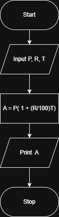
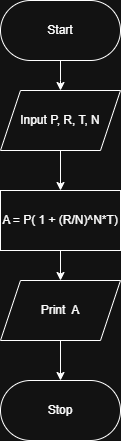
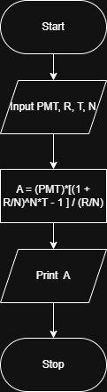

{
 "cells": [
  {
   "cell_type": "markdown",
   "id": "8524a60a-109d-4a86-b103-61cf14899644",
   "metadata": {},
   "source": [
    "### 1. Simple Interest Flowchart\n",
    "This flowchart shows the logic for calculating the total amount (A) using simple interest.\n",
    "\n",
    "\n",
    "---\n",
    "\n",
    "### 2. Compound Interest Flowchart\n",
    "This logic calculates the final balance when interest is compounded N times per year.\n",
    "\n",
    "\n",
    "---\n",
    "\n",
    "### 3. Annuity Plan Flowchart\n",
    "This flowchart represents the process for calculating the future value of a periodic payment plan.\n",
    ""
   ]
  },
  {
   "cell_type": "code",
   "execution_count": null,
   "id": "8b2fcb99-dd5e-48d6-aa11-3dda901143ae",
   "metadata": {},
   "outputs": [],
   "source": []
  }
 ],
 "metadata": {
  "kernelspec": {
   "display_name": "Python 3 (ipykernel)",
   "language": "python",
   "name": "python3"
  },
  "language_info": {
   "codemirror_mode": {
    "name": "ipython",
    "version": 3
   },
   "file_extension": ".py",
   "mimetype": "text/x-python",
   "name": "python",
   "nbconvert_exporter": "python",
   "pygments_lexer": "ipython3",
   "version": "3.13.5"
  }
 },
 "nbformat": 4,
 "nbformat_minor": 5
}
